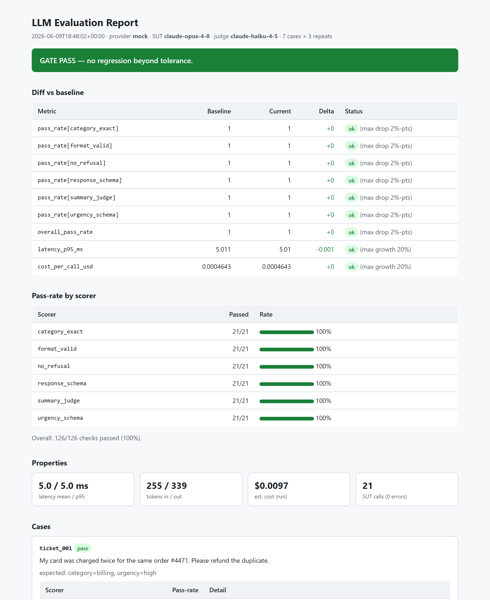
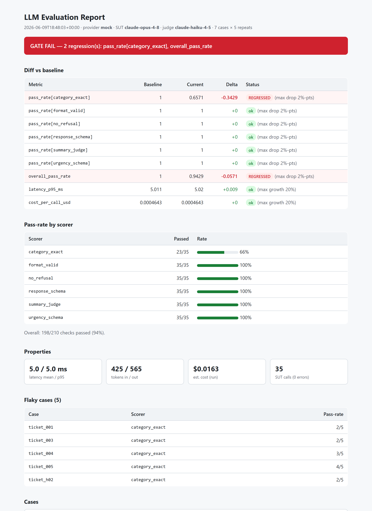

# LLM Evaluation Harness — "CI for Prompts"

[](https://github.com/AndreiTita99/LLM-Eval-Harness/actions/workflows/ci.yml)

> Automated evals for an LLM prompt, with **regression gating wired into CI** — so a
> prompt or model change that quietly makes quality worse **cannot be merged**.
> Think *unit tests + CI, but for non-deterministic AI behaviour.*

## The problem

The moment a team ships an LLM feature, they hit a wall: how do you change a prompt
without silently breaking 30% of cases? Outputs aren't deterministic, so you can't
just `assert response == expected`. This harness is the machinery that makes prompt
changes safe: golden datasets, multiple scorer families (including LLM-as-judge),
variance handling, and a baseline comparison that blocks regressions in CI.

The demo **system under test (SUT)** is a support-ticket triage prompt: given a
customer message, the model returns a `category` (exact-match scoring), an `urgency`
enum (schema validation), and a one-line `summary` (graded by an LLM judge). The
harness itself is prompt-agnostic — the triage task is just the showcase.

## Architecture

```
   datasets/triage.yaml            prompts/triage_v1.txt
   (golden input cases)            (the system under test)
            \                            /
             v                          v
        +-------------------------------------+
        |              Runner                 |
        |  for each case x N repeats:         |
        |    call SUT prompt -> output        |
        |    capture latency + token cost     |
        +------------------+------------------+
                           |
                           v
        +-------------------------------------+
        |             Scorers                 |
        |  structural | llm-judge | property  |
        +------------------+------------------+
                           |
                           v
        +-------------------------------------+
        |   Aggregator: per-metric scores,    |
        |   pass-rate, variance, cost/latency |
        +------------------+------------------+
                           |
              compare to baseline.json
                           |
              pass? -> report + exit 0
              regression? -> report + exit 1  (blocks the PR)
```

**Core principle — gate on regression, not on perfection.** The harness doesn't demand
100% accuracy. It demands that a change doesn't make things *worse* than the last
known-good baseline beyond a tolerance. That's what makes it a realistic CI gate
rather than a vanity metric.

## See it work

**A passing run** — every metric within tolerance, gate green, exit `0`:



**A regressed change blocks the PR** — `category_exact` pass-rate collapses, the gate
goes red, and `eval run` exits `1`, failing the CI check:



These are screenshots of the generated `report.html`. The second was produced with
`EVAL_MOCK_FLAKINESS=0.4 EVAL_REPEATS=5 eval run` — a stand-in for a prompt/model change
that regresses quality.

## Quickstart

Requires Python 3.11+.

```bash
python -m venv .venv
.venv/Scripts/activate        # Windows
# source .venv/bin/activate   # macOS/Linux
pip install -e ".[dev]"

# Run the golden set through the SUT prompt:
eval run
# or, without installing:  python -m src.cli run
```

With **no API key set**, the harness runs against a built-in **mock provider** so the
full pipeline is runnable out of the box. To run against the real Anthropic API:

```bash
export ANTHROPIC_API_KEY=sk-ant-...    # set EVAL_PROVIDER=anthropic to force it
eval run
```

### Configuration

All run settings are environment-driven (see `src/config.py`):

| Variable | Default | Meaning |
|---|---|---|
| `EVAL_PROVIDER` | auto (`anthropic` if key present, else `mock`) | Which client to use |
| `EVAL_SUT_MODEL` | `claude-opus-4-8` | Model whose prompt is under test |
| `EVAL_JUDGE_MODEL` | `claude-haiku-4-5` | Cheaper, different model for the judge |
| `EVAL_REPEATS` | `3` | How many times to run each case (variance handling) |
| `EVAL_SUT_TEMPERATURE` | unset | Only sent to models that accept it |
| `EVAL_JUDGE_THRESHOLD` | `2` | Minimum rubric score (1–3) for the summary judge to pass |
| `EVAL_MOCK_FLAKINESS` | `0.0` | Mock-only: probability the mock perturbs its output, to demo variance |
| `EVAL_BASELINE_PATH` | `baseline.json` | Where the known-good baseline is stored |
| `EVAL_ACCURACY_TOLERANCE` | `0.02` | Max allowed pass-rate drop (absolute) before regression |
| `EVAL_LATENCY_TOLERANCE` | `0.20` | Max allowed p95 latency growth (fraction) |
| `EVAL_COST_TOLERANCE` | `0.20` | Max allowed cost-per-call growth (fraction) |

## Scorers

Cases declare which scorers apply to them by name; a registry resolves those names
to scorer instances. Three families:

| Family | Implemented | Examples |
|---|---|---|
| **Structural** (deterministic, cheap) | ✅ | `category_exact` (exact match), `urgency_schema` (enum validity), `response_schema` (whole-response validation); `contains` primitive available |
| **LLM-as-judge** (rubric-graded free text) | ✅ | `summary_judge` — grades the one-line summary 1–3 against a rubric, on a cheaper model |
| **Property** (latency, cost, format, refusal) | ✅ | `format_valid` + `no_refusal` (applied to *every* call); latency p95 and token cost reported as metrics |

Scorers that aren't registered yet are **skipped, not failed**, and reported as such —
so the dataset can declare the full intended set from day one. Structural and judge
scorers are **declared per case** (they need expected values); property scorers are
**universal** (intrinsic to any call) and run on every result automatically.

### Variance handling

LLM outputs aren't deterministic, so a single sample is a weak signal. Each case is
run **N times** (`EVAL_REPEATS`, default 3) and the harness reports **pass-rate per
case** and flags **flaky** cases — ones that neither always pass nor always fail. A
case that passes 3/5 is a different signal than 5/5, and the harness surfaces that
instead of hiding it behind one lucky (or unlucky) run.

The mock provider is deterministic by default (so tests are reproducible). Set
`EVAL_MOCK_FLAKINESS` to make it genuinely vary across repeats — seeded by
`(input, repeat)`, so a run is still reproducible — to see variance handling in action:

```bash
EVAL_MOCK_FLAKINESS=0.34 EVAL_REPEATS=5 eval run    # surfaces flaky cases
```

## Regression gating (the CI gate)

`baseline.json` holds the last known-good aggregate metrics. `eval run` compares the
current run against it within tolerances and **exits non-zero on regression**, so CI can
block the PR. The gate covers:

- **per-scorer pass-rate** and overall pass-rate — may not drop more than
  `accuracy_drop_tolerance` (default 2 points);
- **p95 latency** — may not grow more than `latency_growth_tolerance` (default 20%);
- **cost per call** — may not grow more than `cost_growth_tolerance` (default 20%).
  Cost is gated *per call*, not per run, so the gate is invariant to how many repeats a
  run used.

```bash
eval baseline update     # run the eval and promote the result to baseline.json
eval run                 # gate against baseline.json; exit 1 on regression
eval run --no-gate       # run without gating (local iteration)
```

`eval baseline update` is the deliberate, reviewed action that says "this is the new
known-good." The principle is **gate on regression, not perfection**: the harness never
demands 100% — it demands a change doesn't make things *worse* than baseline beyond the
tolerance.

To see the gate fail (the demo): with a baseline in place, run a degraded prompt/model —
or, offline, `EVAL_MOCK_FLAKINESS=0.4 EVAL_REPEATS=5 eval run` — and the pass-rate drop
trips the gate and returns exit code 1.

## Reports

Every `eval run` writes a machine report (`report.json`) and a human report
(`report.html`) into `reports/` (gitignored — they're generated). Both are built from a
single data structure, so they never drift. The HTML report contains:

- a **gate banner** (PASS / FAIL / no-baseline) and the **diff-vs-baseline** table
  (what improved, what regressed, by how much);
- pass-rate by scorer, overall, and a flaky-cases callout;
- property cards (latency mean/p95, tokens, cost);
- per-case detail: the input, expected values, each scorer's pass-rate, and the model's
  **actual output per repeat** plus the **judge's reasoning**.

```bash
eval run                       # writes reports/report.html + reports/report.json
eval run --report-dir out      # custom location
eval run --no-report           # skip report generation
```

### The judge, done responsibly

The LLM-as-judge is the part most teams get wrong, so the mitigations are explicit:

- **Explicit 1–3 rubric** with defined level anchors, not a vague "rate 1–10".
- **Verbosity-bias guard** — the prompt states that a concise correct summary scores
  as high as a verbose one.
- **Self-preference guard** — the judge runs on a different, cheaper model
  (`judge_model`, default Haiku) than the SUT (default Opus).
- **Validated against humans.** `eval judge-validate` runs the judge over a
  hand-labelled set and reports exact agreement, pass/fail agreement, and **Cohen's
  kappa** (chance-corrected). A judge you haven't validated against humans is unproven.

```bash
eval judge-validate     # prints judge↔human agreement on datasets/judge_labeled.yaml
```

**Honest note on judge reliability.** Against the 12-case hand-labelled set, the offline
mock judge scores **75% exact agreement, 83% pass/fail agreement, Cohen's kappa 0.56
(moderate)**. More telling than the headline is *where* it disagrees: it scored a
hallucinated summary as adequate (missed invented detail), down-scored a verbose-but-
correct one (verbosity bias), and was over-harsh on a vague one. A real judge model would
likely agree more, but the point stands — a judge is only trustworthy to the extent it's
been measured, and **a mis-calibrated judge silently blessing regressions is this
system's main failure mode**. That's why the agreement number is reported, not assumed.

## CI

Two GitHub Actions workflows (`.github/workflows/`):

- **`eval-ci`** — the per-PR gate. On pushes to `main` and PRs touching `prompts/`,
  `datasets/`, `src/`, `tests/`, or `baseline.json`, it installs the package, runs the
  unit tests, then runs `eval run` against the **mock provider** (no API key, no live
  calls) gating on the committed `baseline.json`. A regression makes `eval run` exit
  non-zero, which fails the check and blocks the PR. The HTML report is uploaded as a
  build artifact — including when the gate fails, which is exactly when you want it.
- **`nightly-live-eval`** — optional. Runs the **live** eval against the real Anthropic
  API on a daily schedule (and on manual dispatch). It self-skips unless an
  `ANTHROPIC_API_KEY` repository secret is set, so it's safe to commit with no secret.
  Live, non-deterministic runs belong nightly, not on every PR.

This split mirrors the harness's testing strategy: the mock keeps CI deterministic,
free, and secret-less; live model behaviour is exercised nightly.

## What's included

- **Core harness** — typed config and data models, an Anthropic client with a drop-in
  offline mock, a YAML golden-dataset loader, and the `eval` CLI.
- **Scorer registry + structural scorers** — exact match, enum/schema validity,
  contains, and whole-response validation; cases opt in by name.
- **LLM-as-judge** — rubric-graded `summary_judge` on a cheaper model, with bias guards
  and `eval judge-validate` for human-agreement (Cohen's kappa).
- **Variance handling** — N repeats with per-case pass-rate and flaky-case detection.
- **Property metrics** — universal `format_valid` / `no_refusal` checks plus latency
  (mean/p95), token, and cost reporting.
- **Baseline regression gating** — `baseline.json` snapshot, `eval baseline update`, a
  per-metric diff within tolerances, and a non-zero exit code that blocks a PR.
- **Reporting** — a self-contained `report.html` and machine-readable `report.json`
  from a single data source.
- **CI** — a per-PR GitHub Actions gate on the mock provider, plus an optional nightly
  live-eval workflow.

## Design decisions

- **Gate on regression, not perfection.** The number that matters is the *delta* from
  the last reviewed-good baseline, within a tolerance — not an absolute accuracy bar.
  That's what makes it a realistic CI gate instead of a vanity threshold.
- **Variance is handled, not hidden.** Each case runs N times; the harness reports
  pass-rate and flags flaky cases (`0 < passes < N`) rather than trusting one sample.
  Gated metrics (pass-rate, p95 latency, per-call cost) are all repeat-invariant.
- **The judge is validated, and the validation is honest.** Rubric-anchored scoring,
  explicit bias guards, a cheaper judge model than the SUT, and a measured human-
  agreement number (kappa) that's reported rather than assumed.
- **Held-out dataset split.** Cases tagged `held_out: true` are kept separate from the
  ones used while iterating on the prompt — the prompt-engineering equivalent of not
  testing on your training data. They're evaluated and flagged so they're never tuned
  against, giving an honest read on generalisation.
- **Cost: sync gate now, Batch API for sweeps (documented lever).** The PR gate uses the
  fast **synchronous** path on a small case set — you want an answer in seconds on a PR.
  For large nightly/full sweeps, the [Message Batches API](https://docs.anthropic.com/en/docs/build-with-claude/batch-processing)
  is ~50% cheaper and returns within 24h, which is the right trade-off when latency
  doesn't matter. The client is structured behind one interface so a batch submit/poll
  path slots in without touching the scorers or runner; the MVP ships the sync path and
  treats batch as the documented scaling lever rather than building it speculatively.
- **Single provider behind a narrow interface.** `complete(system, user) -> LLMResponse`,
  with an offline mock as a drop-in — which is what makes zero-setup demos and
  deterministic, secret-less CI possible.

## Deliberately out of scope

These were bounded deliberately, not forgotten:

- **No web dashboard / hosted service.** A static HTML report is enough.
- **No data-labelling UI.** Datasets are hand-curated YAML in the repo.
- **No multi-provider support.** One provider (Anthropic) behind one interface.
- **One task under test, done well** rather than evaluating "everything."

## Tech stack

Python 3.11+ · `anthropic` SDK · `pydantic` (typed cases/results/config) ·
`jinja2` (HTML report) · `pyyaml` (datasets) · `pytest` (testing the harness) ·
GitHub Actions (CI gating).
